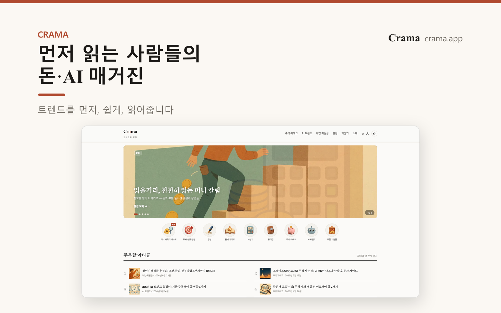
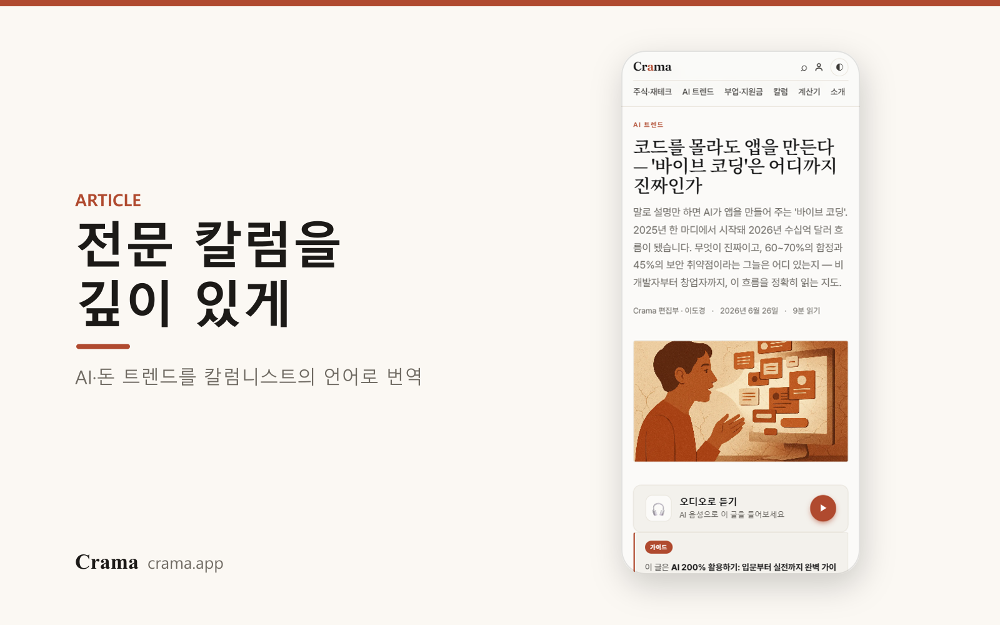
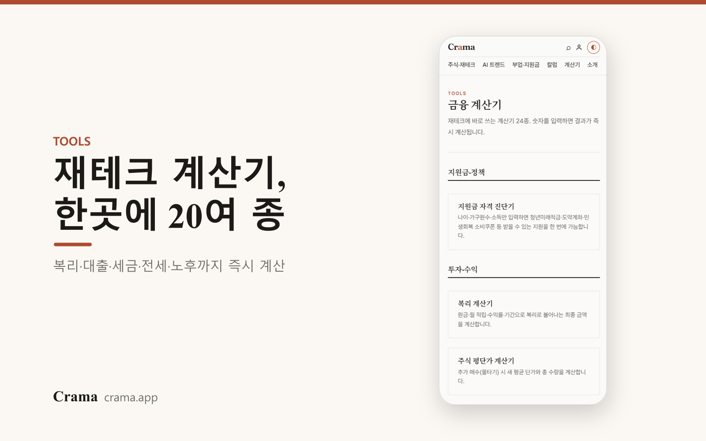
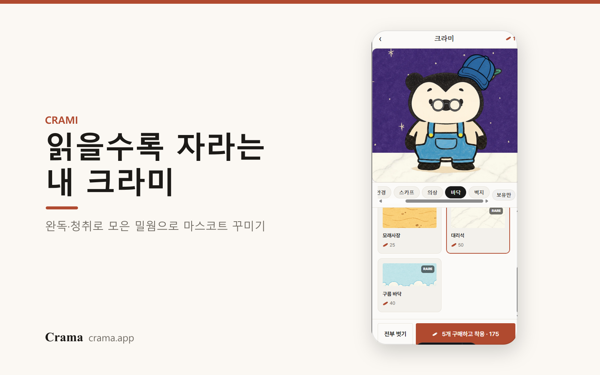
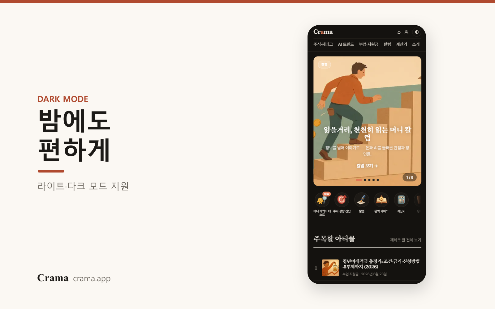

<div align="center">



# Crama 🎧

### 듣는 돈·AI 트렌드 매거진

**트렌드를 먼저 읽는 사람들.** 부의 격차는 돈이 아니라 _정보의 시차_ 에서 시작됩니다.<br/>
Crama는 주식·재테크·지원금과 AI 트렌드를 **먼저, 쉽게, 읽어주는** 매거진입니다.

[**🌐 crama.app**](https://crama.app) · [🎧 Apple Podcasts](https://podcasts.apple.com/podcast/id6783594375) · [🟢 Spotify](https://open.spotify.com/show/033DHRPU1sMJr3RdugoqTG)


<br/>

<a href="https://jocohunt.com/p/tu87yztf" target="_blank" rel="noopener">
  <picture>
    <source media="(prefers-color-scheme: dark)" srcset="https://jocohunt.com/images/badges/top1-dark.svg" />
    
  </picture>
</a>

**🏆 [조코헌트](https://jocohunt.com/p/tu87yztf) 주간 1위** — 등록 <b>하루 만에</b> 달성 · 월간·연간도 현재 1위<br/>
<sub>※ 월간·연간 순위는 집계 중이라 변동될 수 있습니다.</sub>

</div>

---

## ✨ 무엇을 하나요

복잡한 돈·AI 트렌드를 칼럼니스트의 언어로 번역하고, **오디오로 읽어줘** 출퇴근길에 ‘듣는’ 매거진이 됩니다.

|  |  |
|---|---|
| 🎧 **오디오 매거진** | 모든 글을 자연스러운 음성으로. 읽는 위치 자동 하이라이트 + 끝나면 다음 글 이어 듣기 + 팟캐스트(애플·스포티파이) 연동 |
| 🧮 **금융 계산기 20여 종** | 복리·대출·세금·전세·노후까지 숫자만 넣으면 즉시 계산 |
| 💬 **용어 툴팁** | 어려운 용어에 점선, 탭 한 번에 쉬운 풀이 |
| 🐾 **마스코트 크라미** | 읽고 들으면 ‘밀웜’을 모아 마스코트를 꾸미는 가벼운 재미(완독·청취 보상, 스크랩) |
| 🧭 **칼럼 / 가이드** | 정보성·칼럼을 형식으로 구분, 카테고리 필터 |
| 🌙 **다크모드 · 뉴스레터** | 라이트/다크 모드, 무료 구독 |

## 🖼️ 둘러보기

<table>
  <tr>
    <td width="50%"></td>
    <td width="50%"></td>
  </tr>
  <tr>
    <td width="50%"></td>
    <td width="50%"></td>
  </tr>
</table>

## 🤖 콘텐츠 자동화 파이프라인

매일 **09:00 (KST)** GitHub Actions가 글 한 편을 **끝까지 자동으로 발행**합니다.

```text
리서치(web search) → 작성(Claude) → 품질·중복 게이트 → 히어로 이미지(OpenAI)
      → MDX 발행 → 오디오(Azure TTS → R2) → IndexNow 색인
      → git push → Vercel 자동 배포 → 팟캐스트 에피소드 자동 추가
```

> 사람 개입 없이 **글·이미지·오디오·팟캐스트·색인·배포**까지 매일 돌아갑니다.
> 손으로 쓰는 고품질 칼럼은 별도로 발행할 수 있고, 글 → 인스타/스레드 카드뉴스도 스크립트로 자동 생성합니다.

## 🛠 기술 스택

- **Frontend** — [Astro](https://astro.build) 정적 빌드(SSG), MDX 콘텐츠 컬렉션
- **Deploy** — Vercel (`main` 푸시 → 자동 배포)
- **Storage** — Cloudflare R2 (오디오 MP3 · 이미지)
- **AI / Media** — Anthropic Claude(작성) · OpenAI `gpt-image-1`(이미지) · Azure Neural TTS(오디오)
- **자동화** — Node 스크립트(`/automation`) + GitHub Actions(cron)
- **SEO** — 사이트맵 · RSS · JSON-LD · IndexNow · 팟캐스트 RSS

## 📂 구조

```text
site/                     Astro 사이트
  src/content/blog/        글 (MDX)
  src/components/          오디오 플레이어 · 용어 툴팁 · 헤더/푸터 · 카드 등
  src/pages/tools/         금융 계산기
automation/               콘텐츠·미디어·소셜 자동화
  run.js                   일일 발행 파이프라인 (리서치→작성→이미지→오디오→색인)
  gen-audio.js             Azure TTS 오디오 생성
  gen-cards.js             글 → 인스타/스레드 카드뉴스
  social-post.js           인스타 자동 게시
  gen-launch.js            출시 소재(런치 갤러리) 생성
.github/workflows/        매일 자동 발행 워크플로
```

---

<div align="center">
<br/>
<b>Crama</b> · 트렌드를 읽다 · <a href="https://crama.app">crama.app</a><br/>
<sub>“부의 격차는 돈이 아니라 정보의 시차에서 시작된다.”</sub>
</div>
